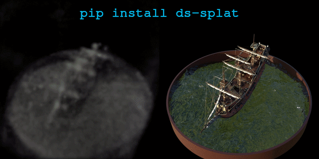
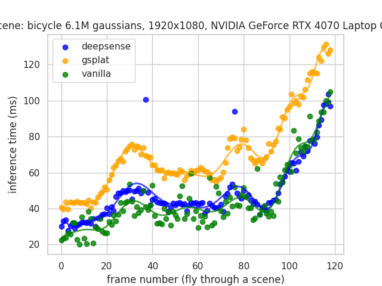
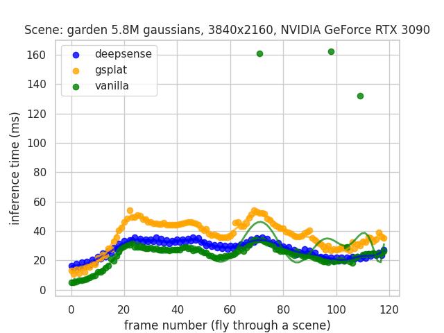
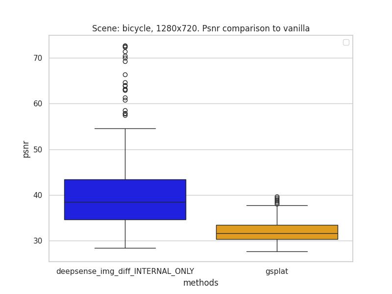

# 🖌️ deepsense.ai 3D Gaussian Splatting

Fastest open-source implementation (Apache 2.0 License) of 3D Gaussian Splatting rasterizer function as forward/backward 
CUDA kernels. Forward call is our original work and our backward code is based on 
[nerfstudio's gsplat](https://github.com/nerfstudio-project/gsplat) implementation.
We are using the same api as Vanilla [graphdeco-inria 3D Gaussian Splatting implementation](https://github.com/graphdeco-inria/gaussian-splatting), 
so it is very easy to replace original render calls simply by swapping the import.




## Table of Contents
- [⚡ Get fastest open-source forward/backward kernels](#-get-fastest-open-source-forwardbackward-kernels)
  - [📦 Get From PyPI](#-get-from-pypi)
  - [💡 Integrated into Gaussian Splatting Lighting](#-integrated-into-gaussian-splatting-lighting)
- [🔧 Install from repository](#-install-from-repository)
  - [🐍 Using Python Extension](#-using-python-extension)
  - [🛠 CPP Project Initialization](#-cpp-project-initialization)
- [🔄 How to switch to open-source KNN](#-how-to-switch-to-open-source-knn)
- [📊 Benchmarks](#-benchmarks)

## ⚡ Get fastest open-source forward/backward kernels

Fastest open-source and easy to use replacement for these who are using non-commercial friendly Vanilla
[graphdeco-inria 3D Gaussian Splatting implementation](https://github.com/graphdeco-inria/gaussian-splatting).

- Forward and backward CUDA calls
- Fastest open-source
- Easy to integrate
- Thrust and Torch I/O API

### 📦 Get From PyPI

Follow this step, if you are already using Vanilla's [graphdeco-inria 3D Gaussian Splatting implementation](https://github.com/graphdeco-inria/gaussian-splatting)
in your project and you want to replace forward/backward kernels
with deepsense.ai open-source kernels.

Make sure CUDA compiler is installed in your environment and simply install:
```bash
pip install ds-splat
```

You are good to go just by swapping imports:
```diff
- from diff_gaussian_rasterization import GaussianRasterizationSettings, GaussianRasterizer
+ from ds-splat import GaussianRasterizationSettings, GaussianRasterizer
```

After swapping to our code, you will keep 3D Gaussian Splatting functionality (backward and forward passes) and you 
will use open-source code. If you also want to use open-source code for the KNN step in preprocessing, scroll down!

### 💡 Integrated into Gaussian Splatting Lighting

If you are rather starting project from scratch and are interested in end-to-end environment, we recommend to check
our integration into [gaussian-splatting-lighting](https://github.com/yzslab/gaussian-splatting-lightning) repository.
Gaussian splatting lighting repository is under MIT License, but submodules like Vanilla's forward/backward kernels or 
KNN implementation has non-commercial friendly license. You can use deepsense ds-splat as a backend, and this way using 
fastest open-source forward/backward kernel calls.


## 🔧 Install from repository

Instead of installing from PyPI, you can install ds-splat package directly from this repository.

### 🐍 Using Python Extension

you can use pip install in the project's root directory:
```bash
pip install .
```

Via setup.py, this will compile CUDA and CPP code and will install ds-splat package.

### 🛠 CPP Project Initialization

This is a bit more manual and you don't have to make it if you installed from PyPI or with the above pip install.

If you prefer to build project from scratch follow instructions here.

This project uses conan for additional dependencies i.e. Catch2. To generate CMake project follow these instructions:

```bash
cd cuda_rasterizer # make sure you are in the root directory
conan install . -of=conan/x86_reldebug --settings=build_type=RelWithDebInfo --profile=default
mkdir build_cpp; cd build_cpp
cmake  -DCMAKE_PREFIX_PATH=`python -c 'import torch;print(torch.utils.cmake_prefix_path)'` -DCMAKE_TOOLCHAIN_FILE=../conan/x86_reldebug/build/RelWithDebInfo/generators/conan_toolchain.cmake -DBUILD_TESTING=ON -DCMAKE_BUILD_TYPE=RelWithDebInfo ..
make
```

If there are any problems regarding runtime exception (e.g. `std::bad_alloc`) or link errors make sure to edit your conan profile to use specific ABI.
Following conanfile was tested:


``` 
[settings]
arch=x86_64
build_type=Release
compiler=gcc
compiler.cppstd=17
compiler.libcxx=libstdc++
compiler.version=11
os=Linux
```

## 🔄 How to switch to open-source KNN

If you are using for e.g. [gaussain splatting lighting](https://github.com/yzslab/gaussian-splatting-lightning) repository,
then forward/backward CUDA kernels and KNN are under [Gaussian-Splatting License](https://github.com/graphdeco-inria/gaussian-splatting?tab=License-1-ov-file#readme).
When you switch to our code following instructions above, you will use our open source forward and backward calls. 
Here, we provide instructions on how to also use open source KNN implementation via Faiss. This instruction is for 
replacing KNN implementation in [gaussain splatting lighting](https://github.com/yzslab/gaussian-splatting-lightning) 
repository.

#### Install Faiss
https://github.com/facebookresearch/faiss/blob/main/INSTALL.md
For example, if you are using conda, in your environment install:
```bash
conda install -c pytorch -c nvidia -c rapidsai -c conda-forge faiss-gpu-raft=1.8.0
```

#### Modify GaussianModel class

1. localize gaussian_model.py file that contains class GaussianModel
2. import faiss
    ```python
    import faiss
    ```
3. add method for averaged distances
    ```python
    def _get_averaged_distances(self, pcd_points_np: np.ndarray, method: str = "CPU_approx", device_id: int = 0,
                                k: int = 4, dim: int = 3, nlist: int = 200) -> np.ndarray:
        """
        This method takes numpy array of points and returns averaged distances for k-nearest neighbours
        for each query point (excluding query point). Database/reference points and query points are same set.

        Using Faiss as a backend.


        Args:
            pcd_points_np: pcd points as numpy array
            method: how faiss create indices and what is target device for calc. {"CPU", "GPU", "CPU_approx",
                    "GPU_approx"}
            device_id: GPU device id
            k: k-nearest neighbours (including self)
            dim: dimentionality of the dataset. 3 by default.
            nlist: the number of clusters or cells in the inverted file (IVF) structure when using an IndexIVFFlat
                   index. Only relevant for approximated methods.

        Returns:
            numpy array as mean from k-nearest neighbour (except self) for each query point
        """
        valid_index_types = {"CPU", "GPU", "CPU_approx", "GPU_approx"}
        pcd_points_float_32 = pcd_points_np.astype(np.float32)

        if method == "CPU":
            index = faiss.IndexFlatL2(dim)
        elif method == "GPU":
            res = faiss.StandardGpuResources()
            index = faiss.GpuIndexFlatL2(res, dim)
        elif method == "CPU_approx":
            quantizer = faiss.IndexFlatL2(3)  # the other index
            index = faiss.IndexIVFFlat(quantizer, dim, nlist)
        elif method == "GPU_approx":
            res = faiss.StandardGpuResources()
            quantizer = faiss.IndexFlatL2(3)  # the other index. Must be CPU as nested GPU indexes are not supported
            index = faiss.index_cpu_to_gpu(res, device_id, faiss.IndexIVFFlat(quantizer, dim, nlist))
        else:
            raise ValueError(f"Invalid index_type. Expected one of {valid_index_types}, but got {method}.")

        if method in {"CPU_approx", "GPU_approx"}:
            index.train(pcd_points_float_32)
        index.add(pcd_points_float_32)

        D, _ = index.search(pcd_points_float_32, k)
        D_mean = np.mean(D[:, 1:], axis=1)

        return D_mean
    ```
4. localize create_from_pcd(...) method and modify it.
    Replace lines:
    ```diff
    - dist2 = torch.clamp_min(distCUDA2(torch.from_numpy(np.asarray(pcd.points)).float().cuda()), 0.0000001).to(deivce)
    + dist_means_np = self._get_averaged_distances(pcd_points_np=pcd_points_np, method="CPU_approx")
    + dist2 = torch.clamp_min(torch.tensor(dist_means_np), 0.0000001).to(deivce)
    ```

This way you have modified the KNN method. Now it is independent from a 
[licensed](https://github.com/graphdeco-inria/gaussian-splatting?tab=License-1-ov-file#readme) 
submodule (distCUDA2 method) and now it is open source!

## 📊 Benchmarks

We have conducted a series of benchmarks, comparing deepsense implementation inference runtime to vanilla implementation
[graphdeco-inria 3D gaussian splatting implementation](https://github.com/graphdeco-inria/gaussian-splatting)
and to [nerfstudio's gsplat](https://github.com/nerfstudio-project/gsplat) implementation.


Below plots present inference time in ms measured for 120 frames as fly through a scene with zooming out to capture all
Gaussians. 6.1M Gaussians rendered in 1920x1080 with an NVIDIA 4070 Laptop GPU and 5.8M Gaussians rendered in 3840x2160 
with an NVIDIA 3090 GPU.





For trained scenes, we have also compared PSNR (Peak Signal-to-Noise Ratio) for deepsense and gsplat methods to 
Vanilla as ground truth. Using Vanilla's inria implementation, we rendered images when flying through a scene, 
treating them as ground truth. For deepsense and gsplat implementations, we rendered scenes from the same camera 
positions and compared them to Vanilla. This test shows how close our/gsplat implementation is to Vanilla's. Some 
details are implementation-specific and result in slightly different outcomes, but both methods have very good PSNR in 
this regard. Higher PSNR is better.

📥 [Download](https://drive.google.com/file/d/1MADQzb6onTV6JBJQqTx8H9bN6It4Vcdj/view?usp=sharing) more benchmark plots from GDrive.


